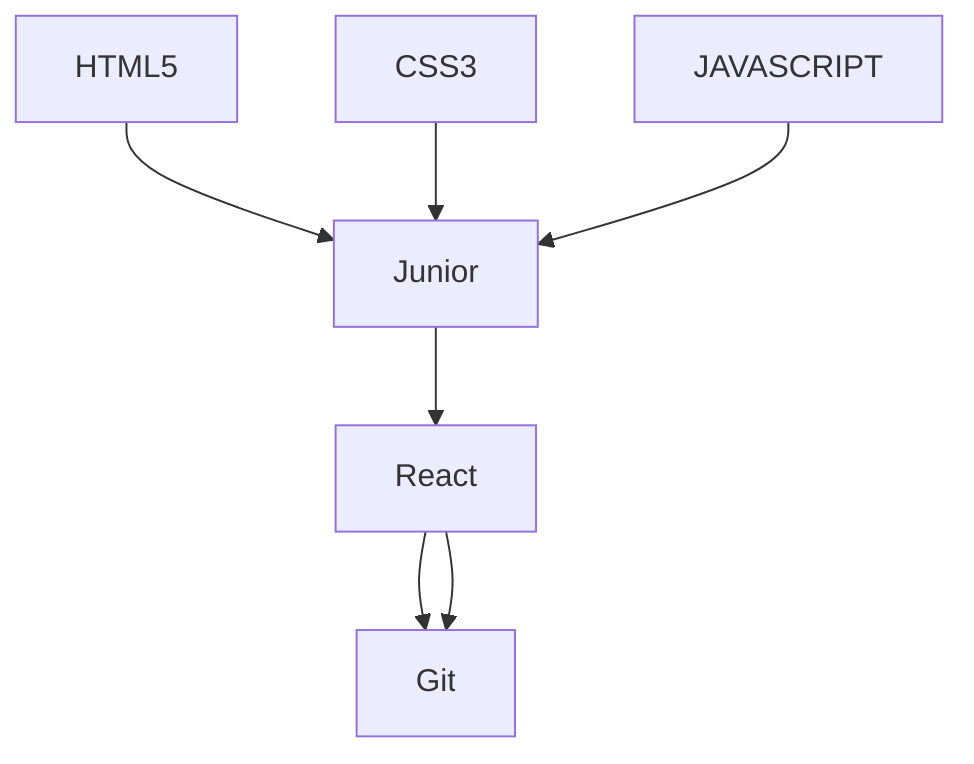

  {
      "type": "Feature",
      "id": 1,
      "properties": {
        "ID": 0
      },
      "geometry": {
        "type": "Polygon",
        "coordinates": [
          [
              [-90,35],
              [-90,30],
              [-85,30],
              [-85,35],
              [-90,35]
          ]
        ]
      }
    }
  ]
}
 
 
 
 
 <a name="regrego" id="regreso"></a>

<!-----------nav html ------------------->

  


 :octocat: <a href="#home">Home</a> :jack_o_lantern: <a href="#skill">Skill </a> :ghost: <a href="#portfolio">portfolio </a>  :computer:
 <a href="#">Skill </a>	:iphone:  <a href="#contact">Contact</a>   	

  
 


 
 <!-- ---------------------------------------------------------------------------------------------------------->
 
 
 


 
 
 
  <!-- ----------------------- redes sociales ------>
 

 

  <!-- --------------------------------------------------------------------------------------------------------------------------------------->

 <!-- presentacion  -->
 
 # About me
 :maple_leaf::maple_leaf::maple_leaf::maple_leaf::maple_leaf::maple_leaf::maple_leaf:
 

```python

Hola Soyy gregor Desarrollador web autodidacta, siempre me ha gustado la tecnologia ,lo queme me llevo a aprender 
computación
```
 
 ```ruby
 luego la internet y las redes sociales me mostraron el lenguaje HTML junto al CSS fue asi como descubri la programacion
 
 ```
 
```css
 y desde entonces no e parado de aprender y sigo aprendiendo cada dia,por ahora estoy enfocado en el desarrollo web pero 
 con mucha intencion de aprende el desarrollo de software,  pero aprender varios lenguajes 
 
 
 
 


```

```ruby
     
    " Task lists "
     
    " cosas que quiero apender y mejorar"son muchas
```

- [x] aprender mas lenguajes 
- [ ] aprender as ingles
- [ ] huy tantas cosas :tada:
- [x] aprender mas lenguajes 
- [ ] aprender as ingles
- [ ] huy tantas cosas :tada:- 
- [ ] huy tantas cosas :tada:- 




## :fallen_leaf: :fallen_leaf::fallen_leaf::fallen_leaf::fallen_leaf:
 


 
 <!--------------------------------------------------------------------------------------------------------------------------------------------------------- -->

```json


 
 Lorem Ipsum is simply dummy text of the printing and typesetting industry.Lorem Ipsum has been the industry's standard
 dummy text ever since the 1500s, when an unknown printer took a galley of type and scrambled it to make a type specimen 
 book.It has survived not only five centuries, but also the leap into electronic typesetting, remaining essentially 
 unchanged. It was popularised in the 1960s with the release of Letraset sheets containing Lorem Ipsum passages,and more 
 recently with desktop publishing software like Aldus PageMaker including versions of Lorem Ipsum.
 
  
``` 


      


 <a name="home" id="Home "></a> 
 


<div> 

 


</div>


<p align="left">  </p>


<p align="left"> <a href="https://github.com/ryo-ma/github-profile-trophy"></a> </p>


 <!-----------------------My skills   ---------------------------------------------------------------->
 <!-----------------------My skills   ---------------------------------------------------------------->
 <!-----------------------My skills   ---------------------------------------------------------------->
 <!-----------------------My skills   ---------------------------------------------------------------->
 <!-----------------------My skills   ---------------------------------------------------------------->
 <!-----------------------My skills   ---------------------------------------------------------------->
 <!-----------------------My skills   ---------------------------------------------------------------->
 
 <a name=skill id="Skill "></a>
 :wrench:
 <h1 align="center">Skills</h1>
 

 
  

 
 
 
 

<br><button> HTML5</button>
   
<br><button> CSS3</button>
  
 
 <br><button> GIT</button>
 
  
 <br><button> JAVASCRIPT</button>
 
 <br><button> PHOTOSHOP</button>
 
 <a ><br><button> REACT</button> 
 


 

 
 
 <p align="center">
  </a>
</p>
 
 

 


<!--------------------------- portafolio ------------>
  <!--------------------------- portafolio ------------>
   <!--------------------------- portafolio ------------>

     
     
     
 
 

 <a name="portfolio" id="portfolio"></a> 
 
 
 
 
 <div> 

 


</div>
 
 
 
 ```css

 Trabajos 
https://gregornet.github.io/tron/
https://gregordev.wordpress.com/
 
 https://gregornet.github.io/tron/   
 https://gregordev.wordpress.com/     
 https://www.linkedin.com/in/gregoridev         
 http://linktr.ee/gregordev         
 https://gregornet.github.io/tron/    
 https://gregornet.github.io/tron/  
este sirve


```

 
 
 <!---------------------------------------------------------------------------------------------------------------------------------------------------->
 
 <!---------------------------------------------------------------------------------------------------------------------------------------------------->
  


 
 
 
 
  <a name="ancla-4" id="Stats"></a> 
 

 
   <!----------------------stats--->
 
  <div align="right"> 
 
 <p></p>
   </div> 

 
 <div align="right"> 
<p></p>

</div> 
 
 
<div align="left"> 

<p></p>

</div> 
 
   
   
 
 <!-------------------------------------------------------------------------------------------------------------------------------------------------->
  <details><summary>CLICK ME</summary>
<p>

#### We can hide anything, even code!

```ruby
   puts "aun no se que poner aqui pero algo pondre jejeje"
```

</p>
</details>
 
 
  | info    |info         |info       
| ---     | ---         |         --
| 1       |           2 |  3
| git diff | Show file differences that haven't been staged | qq
|veamos    |  hjgh      |        gjghj    
   
   
 <div align="right" > 
  
  <a  href="#regreso">Arriba</a>
 
 
 </div>
 
  <!-------------------------------------------------------------------------------------------------------------------------------------------------->
 
  <a name="Contact" id="Contact"></a> 

:email: :mailbox: :postbox:
 
  <!------------------contact------->
 
### contact me through :point_down:
 

 
 <a href="https://twitter.com/gregoridev" target="blank"></a> <p align="left"> <a href="https://twitter.com/gregoridev" target="blank"></a> </p>
 
   <!----> <!---->  <!----> <a href="https://linkedin.com/in/gregoridev" target="blank"></a> <!---->   <!---->
 <a href="https://paypal.me/gregoridev" rel="no follow">
 
 
  <!-------------------------------------------------------------------------------------------------------------------------------------------------->
 
 

<!--
**gregornet/gregornet** is a ✨ _special_ ✨ repository because its `README.md` (this file) appears on your GitHub profile.

Here are some ideas to get you started:

- 🔭 I’m currently working on ...
- 🌱 I’m currently learning ...
- 👯 I’m looking to collaborate on ...
- 🤔 I’m looking for help with ...
- 💬 Ask me about ...
- 📫 How to reach me: ...
- 😄 Pronouns: ...
- ⚡ Fun fact: ...

 <h1>
  hey there
  
</h1>


> __Note__


> __Warning__

 
$$\textcolor{yellow}{\text{Hello World}}$$

$$\textcolor{green}{\text{Hello World}}{\text{Hello World}}\textcolor{blue}{\text{Hello World}}$$


-  `sfsfsfsfssf`
-  `#c5f015`
-  `#1589F0`

~~Hi~~ Hello, ~there~ world!


## $\textcolor{yellow}{maracaibo\ ciudad\ bonita}$


$\textcolor{olive}{\TeX} \ \textcolor{darkgray}{workaround \ found \ by \ Dassalem \ Mohammed \ Yasser}$

$\textit{hello}$  #italic

$\text{hello}$    #normal

$\Large{hello}$$   #Bigger text size

$$\LaTeX$$


$\colorbox{red}{text}$

Text inside bordered Box 

$\fbox{Hello there}$

-->
