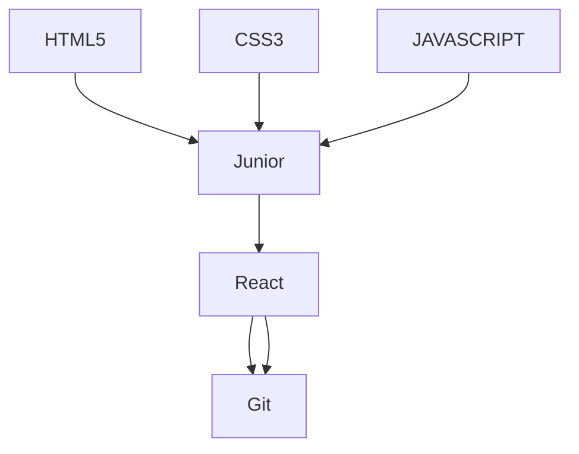

<!--------------      ---------------->
 
 
 <a name="regrego" id="regreso"></a>
 


<!-----------nav html ------------------->


  


 :octocat: <a href="#home">Home</a> :jack_o_lantern: <a href="#skill">Skills </a> :ghost: <a href="#about">About me </a>  :computer:
 <a href="#portfolio">portfolio </a>	:iphone:  <a href="#contact">Contact</a>   	

  
 
 <!-- ---------------------------------------------------------------------------------------------------------->
 
  <!------------------------- texto svg------>
  <!------------------------ texto svg------>
 
 [](https://git.io/typing-svg)
 
 
  <!-------------------------------------------------------------------------->
 
 
 <!-- ----------------------- contador ------>
  <!-- ----------------------- contador ------>
 
 
 <div align="center">
 
 <p align="center"> </p>

  </div> 
  
   <!-- --------------------------->
 
 
 
 
 
<!------------------------- stats ------>
 
 
   
<div align="right"> 
 
 <p></p>
   </div> 

 
 <div align="right"> 
<p></p>

</div> 
 
 
 
 
<div align="left"> 

<p></p>
  

</div> 
   

  
  

  
  
  
 <!------------------------- trofeos ------>  
<div>
 

<p align="left"></a> </p>

 
  </div>
  
   <!------------------------------------------------------------------------------> 
   
   
   
   
   
 
 


 <!-- presentacion  -->
  <a name="about" id="about"></a> 
  

 
 <div>
 
  </div>
 

 :maple_leaf::maple_leaf::maple_leaf::maple_leaf::maple_leaf::maple_leaf::maple_leaf:
 

```python

Hola Soyy gregor Desarrollador web autodidacta, siempre me ha gustado la tecnologia ,lo que me me llevo a aprender 
computación
```
 
 ```ruby
 luego la internet y las redes sociales me mostraron el lenguaje HTML junto al CSS fue asi como descubri la programacion
 
 ```
 

```css

 y desde entonces no e parado de aprender y sigo aprendiendo cada dia,por ahora estoy enfocado en el desarrollo web,
 y poco a poco dar el salto a fullstack ,me gustaria aprender lenguaje de alto nivel y poco a poco me preparo para ello.
 
 ```
 
 $\textcolor{grey}{“La \ tecnología \ no \ es \ nada. \ Lo \ importante \ es \ que \ tengas \ fe \ en \ la \ gente, \ que \ sean \ básicamente \ buenas \ e \ inteligentes,y \ si \ les \ das }$
 
$\textcolor{grey}{ herramientas,\ harán \ cosas \ maravillosas \ con \ ellas”}$


```ruby
     
    " Task lists "
     
    " cosas que quiero aprender y mejorar"son muchas
```

- [ ] learn more languages 
- [ ] improve my English
- [ ] improve my knowledge at senior level :tada:
- [ ] learn more languages maybe a little bit of c++ or python   
- [ ] improve with other frameworks like vue and angular 
- [ ] a remote job :tada:- 
- [ ] oh so many things :tada:- 

- 🔭 I am currently working on my portfolio.
- 🌱 I'm currently learning advanced javascript.
- 👯 I am looking to collaborate in with friends or companies to help me grow.
- 🤔 I am looking for help with remote jobs.
- 💬 Ask me about ...
- 📫 How to contact me: you can contact me by https://twitter.com/gregoridev
- 😄 Pronouns: ...
- ⚡ Fun fact: I am self-taught and a fast learner.




## :fallen_leaf: :fallen_leaf::fallen_leaf::fallen_leaf::fallen_leaf:
 


 
 <!--------------------------------------------------------------------------------------------------------------------------------------------------------- -->


 <a name="home" id="Home "></a> 
 


 <!-----------------------My skills   ---------------------------------------------------------------->
 <!-----------------------My skills   ---------------------------------------------------------------->
 <!-----------------------My skills   ---------------------------------------------------------------->
 <!-----------------------My skills   ---------------------------------------------------------------->
 <!-----------------------My skills   ---------------------------------------------------------------->
 <!-----------------------My skills   ---------------------------------------------------------------->
 <!-----------------------My skills   ---------------------------------------------------------------->
 
 <a name=skill id="Skill "></a>
 :wrench:
 <h1 align="center">My Skills</h1>
 
 <h1 align="center">Language</h1>
 


 
 <table>

<td> <br><button> HTML5</button> </td>
 
 <td><br><button> CSS3</button> </td>
 
 <td> <br><button> JAVASCRIPT</button> </td>
 
 <td>  <br><button> MARKDOWN</button> </td>
 
 <td> coming soon</td>
 
 <td> coming soon </td> 

</table>
 


 <!--------------------------- FrameWorks ------------>
 <!--------------------------- FrameWorks ------------>
 <!--------------------------- FrameWorks ------------>
 
 <h1 align="center">FrameWorks

   

</h1>
 

  
   <a ><br><button> REACT</button>  </a >
  
  
  
  
 
<!--------------------------- tecnologias ------------>
<!--------------------------- tecnologias ------------>


<h1 align="center">Tecnologias</h1>


 <table>

<td> <br><button> VSCODE</button> </td>
 
 <td><br><button> GIT</button> </td>
 
 <td> <br><button> GITHUB</button> </td>
 
 <td>  <br><button> PHOTOSHOP</button> </td>
 
 <td> coming soon</td>
 
 <td> coming soon </td> 

</table>
 
 
  
  
<!--------------------------- portafolio ------------>
  <!--------------------------- portafolio ------------>
   <!--------------------------- portafolio ------------>

     
     
     
 
 

 <a name="portfolio" id="portfolio"></a> 
 
<div>
 
 


 

 
 


 
</div>
 
 
 <table>

<td> https://gregornet.github.io/tron/ </td>
 
 <td> https://gregordev.wordpress.com/  </td>
 
 <td> https://www.linkedin.com/in/gregoridev  </td> </tr>
 
 <td> http://linktr.ee/gregordev   </td>
 
 <td> coming soon</td>
 
 <td> coming soon </td> 

</table>
 
 
 
 <!---------------------------------------------------------------------------------------------------------------------------------------------------->
 
 <!---------------------------------------------------------------------------------------------------------------------------------------------------->
  


 
 
 
 
  <a name="ancla-4" id="Stats"></a> 
 

 
   <!----------------------stats--->
 
 
 
 <!-------------------------------------------------------------------------------------------------------------------------------------------------->

 
 
 
   
   
   
 <div align="right" > 
  
  <a  href="#regreso">Arriba</a>
 
 
 </div>
 
  <div>
 
 <details><summary>CLICK ME</summary>
<p>

#### We can hide anything, even code!

```ruby
   puts "aun no se que poner aqui pero algo pondre jejeje"
```

</p>
 
 $$\textcolor{green}{\text{Hello World}}{\text{Hello World}}\textcolor{blue}{\text{Hello World}}$$
 
</details>
 
 </div>
 
  <!-------------------------------------------------------------------------------------------------------------------------------------------------->
 
  <a name="Contact" id="Contact"></a> 

:email: :mailbox: :postbox:
 
  <!------------------contact------->
 
### contact me through :point_down:
 

 
 <a href="https://twitter.com/gregoridev" target="blank"></a> <p align="left"> <a href="https://twitter.com/gregoridev" target="blank"></a> </p>
 
   <!----> <!---->  <!----> <a href="https://linkedin.com/in/gregoridev" target="blank"></a> <!---->   <!---->
 <a href="https://paypal.me/gregoridev" rel="no follow">
 
 
  <!-------------------------------------------------------------------------------------------------------------------------------------------------->
 
 

<!--
**gregornet/gregornet** is a ✨ _special_ ✨ repository because its `README.md` (this file) appears on your GitHub profile.

Here are some ideas to get you started:

- 🔭 I’m currently working on ...
- 🌱 I’m currently learning ...
- 👯 I’m looking to collaborate on ...
- 🤔 I’m looking for help with ...
- 💬 Ask me about ...
- 📫 How to reach me: ...
- 😄 Pronouns: ...
- ⚡ Fun fact: ...


- 🔭 I am currently working on my portfolio.
- 🌱 I'm currently learning advanced javascript.
- 👯 I am looking to collaborate in with friends or companies to help me grow.
- 🤔 I am looking for help with remote jobs.
- 💬 Ask me about ...
- 📫 How to contact me: you can contact me by https://twitter.com/gregoridev

 <h1>
  hey there
  
</h1>


<!----------- forma de texto y color ------------------->
<!----------- 

$\mathcal{\color{purple}{this \ is \ a \ paragraph} \ \color{cyan}{in \ another \ font}}$

$\mathbb{\color{teal}{this \ is \ a } \ \color{magenta}{paragraph \ in \ another \ font}}$

$\mathscr{\color{red}{this} \ \ \color{blue}{is \ \ a \ \ paragraph} \ \ \color{yellow}{in \ \ another \ \ font}}$

$\mathfrak{\color{lime}{this \ is \ a \ paragraph \ in \ another \ font}}$

$\mathscr{\color{red}{mon}\color{white}{day}}$

------------------->

  <!-----------forma de texto 1 y 2 ------------------->
  <!-----------forma de texto 1 y 2 


###### $\textcolor{yellow}{maracaibo\ ciudad\ bonita}$


$\textcolor{olive}{\TeX} \ \textcolor{darkgray}{workaround \ found \ by \ Dassalem \ Mohammed \ Yasser}$

$\textit{hello}$  #italic

$\text{hello}$    #normal

$\Large{hello}$$   #Bigger text size

$$\LaTeX$$


$\colorbox{red}{text}$

Text inside bordered Box 

$\fbox{Hello there}$ 
  
  
  hey there
  
  ~~Hi~~ Hello, ~there~ world!
  
  
  $$\textcolor{yellow}{\text{Hello World}}$$

$$\textcolor{green}{\text{Hello World}}{\text{Hello World}}\textcolor{blue}{\text{Hello World}}$$

> __Note__


> __Warning__

 
   <!----------------------------------------------------------------------------------------->

 


   <!----------------texto color con bandas------------------------------------------------------------------------->

   <!----------------texto color con bandas--------------------------------------------

  
</h1>


  

-  `About me`
-  `#c5f015`
-  `#1589F0`


  | info    |info         |info       
| ---     | ---         |         --
| 1       |           2 |  3
| git diff | Show file differences that haven't been staged | qq
|veamos    |  hjgh      |        gjghj  
 


[](https://git.io/typing-svg)


-->
 
  <div align="right" > 
  
  <a  href="#regreso">Arriba</a>
 
 
 </div>
